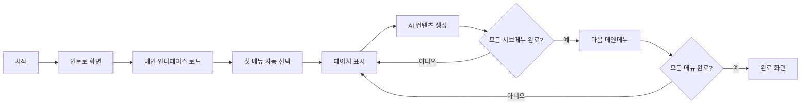

# CMS 템플릿 사이트 구성 마법사 - Product Requirements Document (PRD)

## 1. 제품 개요

### 1.1 프로젝트 정의
CMS에서 템플릿 사이트를 복사한 후, AI를 통해 자동으로 사이트 컨텐츠를 생성하는 비주얼 마법사 인터페이스

### 1.2 핵심 가치
- **자동화**: 수동 컨텐츠 입력 없이 AI가 전체 사이트 구성
- **시각적 피드백**: 실시간으로 생성 과정을 확인
- **사용자 경험**: 지루하지 않고 매력적인 진행 과정

### 1.3 기술 사양
- **Frontend**: HTML5, CSS3, JavaScript (ES6+), jQuery
- **Animation**: Motion.js, CSS Animations
- **Design**: Modern, Minimalist UI
- **Browser Support**: Chrome, Safari, Firefox, Edge (최신 버전)
- **반응형**: 데스크톱 전용 (1920x1080 기준)

## 2. 사용자 인터페이스

### 2.1 레이아웃 구조

```
┌─────────────────────────────────────────────────────────┐
│                    헤더 영역 (로고, 옵션)                   │
├─────────────────┬───────────────────────────────────────┤
│                 │                                       │
│  메뉴 네비게이션   │         페이지 미리보기                │
│     (30%)       │            (70%)                      │
│                 │                                       │
│  ▪ 프로그레스바    │    ┌─────────────────────┐          │
│  ▪ 메뉴 리스트    │    │   브라우저 프레임      │          │
│  ▪ 진행 상태     │    │                     │          │
│                 │    │   AI 생성 컨텐츠     │          │
│                 │    │                     │          │
│                 │    └─────────────────────┘          │
│                 │                                       │
├─────────────────┴───────────────────────────────────────┤
│                    하단 정보 바                           │
└─────────────────────────────────────────────────────────┘
```

### 2.2 색상 시스템

```css
/* Primary Colors */
--primary-blue: #6366F1;      /* 메인 액센트 */
--primary-dark: #4F46E5;      /* 호버 상태 */

/* Status Colors */
--success-green: #10B981;     /* 완료 상태 */
--progress-amber: #F59E0B;    /* 진행 중 */
--neutral-gray: #6B7280;      /* 대기 상태 */

/* Background Colors */
--bg-primary: #FFFFFF;        /* 메인 배경 */
--bg-secondary: #F9FAFB;      /* 서브 배경 */
--bg-tertiary: #F3F4F6;       /* 카드 배경 */

/* Text Colors */
--text-primary: #1F2937;      /* 메인 텍스트 */
--text-secondary: #6B7280;    /* 서브 텍스트 */
--text-muted: #9CA3AF;        /* 비활성 텍스트 */
```

### 2.3 타이포그래피

```css
/* Font Family */
@import url('https://fonts.googleapis.com/css2?family=Inter:wght@400;500;600;700&display=swap');

/* Font Sizes */
--text-xs: 12px;     /* 캡션, 라벨 */
--text-sm: 14px;     /* 메뉴, 일반 텍스트 */
--text-base: 16px;   /* 본문 */
--text-lg: 18px;     /* 서브 헤딩 */
--text-xl: 24px;     /* 메인 헤딩 */
--text-2xl: 32px;    /* 타이틀 */
```

## 3. 컴포넌트 상세 명세

### 3.1 인트로 화면

#### 초기 로딩 시퀀스
1. **페이드인** (0-1초)
   - 로고 + "AI가 당신의 사이트를 만들어드립니다" 메시지
   - opacity: 0 → 1, transform: translateY(20px) → translateY(0)

2. **대기** (1-2초)
   - 사용자가 메시지를 읽을 시간

3. **전환** (2-3초)
   - 인트로 화면 페이드아웃
   - 메인 인터페이스 페이드인

### 3.2 왼쪽 메뉴 영역

#### 3.2.1 프로그레스바
```html
<div class="progress-container">
  <div class="progress-bar">
    <div class="progress-fill" style="width: 0%"></div>
  </div>
  <div class="progress-info">
    <span class="progress-percentage">0%</span>
    <span class="progress-count">0 / 24 페이지</span>
  </div>
</div>
```

**스타일링**:
- 높이: 8px
- 배경: 연한 회색
- 채움: 그라데이션 (--primary-blue → --primary-dark)
- 애니메이션: 부드러운 width 전환 (transition: width 0.5s ease)

#### 3.2.2 메뉴 리스트
```html
<nav class="menu-navigation">
  <ul class="menu-list">
    <li class="menu-item" data-status="waiting">
      <div class="menu-header">
        <span class="menu-icon">○</span>
        <span class="menu-title">About</span>
      </div>
      <ul class="submenu-list">
        <li class="submenu-item" data-status="waiting">
          <span class="submenu-icon">○</span>
          <span class="submenu-title">Welcome Message</span>
        </li>
      </ul>
    </li>
  </ul>
</nav>
```

**상태별 스타일**:

1. **대기 중** (data-status="waiting")
   - 아이콘: ○ (빈 원)
   - 색상: --text-muted
   - 배경: 없음

2. **진행 중** (data-status="processing")
   - 아이콘: ⏳ (모래시계) 회전 애니메이션
   - 색상: --progress-amber
   - 배경: 연한 앰버색 + 펄스 효과
   - 텍스트: "생성 중..." 접미사 추가

3. **완료** (data-status="completed")
   - 아이콘: ✓ (체크마크) 스케일 애니메이션
   - 색상: --success-green
   - 배경: 연한 녹색

### 3.3 중앙 미리보기 영역

#### 3.3.1 브라우저 프레임
```html
<div class="preview-container">
  <div class="browser-frame">
    <div class="browser-header">
      <div class="browser-controls">
        <span class="control red"></span>
        <span class="control yellow"></span>
        <span class="control green"></span>
      </div>
      <div class="browser-url">
        <span>https://mysite.com/about</span>
      </div>
    </div>
    <div class="browser-content">
      <iframe id="preview-iframe" src=""></iframe>
    </div>
  </div>
  <div class="zoom-controls">
    <button data-zoom="50">50%</button>
    <button data-zoom="75">75%</button>
    <button data-zoom="100" class="active">100%</button>
  </div>
</div>
```

#### 3.3.2 컨텐츠 생성 애니메이션

**텍스트 교체 시퀀스**:
```javascript
// 1. 기존 텍스트 페이드아웃
element.style.opacity = '0.3';

// 2. 타이핑 효과로 새 텍스트 입력
const typeWriter = (text, element, speed = 50) => {
  let i = 0;
  element.textContent = '';
  element.style.opacity = '1';
  
  const type = () => {
    if (i < text.length) {
      element.textContent += text.charAt(i);
      i++;
      setTimeout(type, speed);
    }
  };
  type();
};
```

**이미지 교체 효과**:
```css
.ai-generating {
  filter: blur(10px);
  transition: filter 1s ease;
}

.ai-generated {
  filter: blur(0);
}
```

### 3.4 페이지 전환 애니메이션

#### 3.4.1 전환 시퀀스 타임라인
```
시간 (초) | 액션
---------|--------------------------------------------------
0.0      | 현재 페이지 축소 시작 (scale: 1 → 0.95)
0.2      | 현재 페이지 우측 슬라이드 (translateX: 0 → 100%)
0.3      | 메뉴 체크마크 애니메이션
0.4      | 프로그레스바 업데이트
0.5      | 다음 메뉴 하이라이트 이동
0.6      | 새 페이지 좌측에서 진입 (translateX: -100% → 0)
0.8      | 새 페이지 확대 (scale: 0.95 → 1)
1.0      | AI 생성 시작
```

#### 3.4.2 애니메이션 코드
```css
/* 페이지 아웃 */
@keyframes pageOut {
  0% {
    transform: scale(1) translateX(0);
    opacity: 1;
  }
  100% {
    transform: scale(0.95) translateX(100%);
    opacity: 0;
  }
}

/* 페이지 인 */
@keyframes pageIn {
  0% {
    transform: scale(0.95) translateX(-100%);
    opacity: 0;
  }
  100% {
    transform: scale(1) translateX(0);
    opacity: 1;
  }
}
```

## 4. 사용자 플로우

### 4.1 전체 진행 과정



### 4.2 상태 메시지 시스템

```javascript
const statusMessages = {
  'about': [
    "회사 소개 문구를 작성하고 있습니다...",
    "브랜드 스토리를 구성하고 있습니다...",
    "핵심 가치를 정리하고 있습니다..."
  ],
  'research': [
    "연구 분야를 분석하고 있습니다...",
    "주요 프로젝트를 정리하고 있습니다...",
    "연구 성과를 요약하고 있습니다..."
  ]
  // ... 각 메뉴별 메시지
};
```

## 5. 마이크로 인터랙션

### 5.1 호버 효과
- **메뉴 호버**: 배경색 변경 + 우측 화살표 표시
- **버튼 호버**: 스케일 1.05 + 그림자 효과

### 5.2 클릭 피드백
- **버튼 클릭**: 스케일 0.95 (pressed 효과)
- **메뉴 클릭**: 리플 효과 (Material Design 스타일)

### 5.3 완료 애니메이션
```javascript
// 페이지 완료 시 파티클 효과
function celebrateCompletion() {
  confetti({
    particleCount: 30,
    spread: 50,
    origin: { y: 0.7 },
    colors: ['#10B981', '#6366F1', '#F59E0B']
  });
}
```

## 6. 성능 최적화

### 6.1 애니메이션 최적화
- GPU 가속 속성만 사용 (transform, opacity)
- will-change 속성 활용
- requestAnimationFrame 사용

### 6.2 리소스 관리
- 다음 2개 페이지만 프리로드
- 완료된 페이지 iframe 메모리 해제
- 이미지 lazy loading

## 7. 에러 처리

### 7.1 타임아웃 처리
```javascript
const AI_GENERATION_TIMEOUT = 30000; // 30초

setTimeout(() => {
  if (currentStatus === 'processing') {
    showRetryModal();
  }
}, AI_GENERATION_TIMEOUT);
```

### 7.2 에러 UI
- 부드러운 에러 모달
- 재시도 옵션
- 건너뛰기 옵션

## 8. 완료 화면

### 8.1 성공 메시지
- 큰 체크마크 아이콘 + 컨페티 효과
- "축하합니다! 24개 페이지가 모두 완성되었습니다"
- 총 소요 시간 표시

### 8.2 후속 액션
- 생성된 사이트 전체 보기
- 수정이 필요한 페이지 리스트
- 사이트 바로가기 버튼

## 9. 파일 구조

```
/cms-wizard/
├── index.html                  # 메인 HTML
├── assets/
│   ├── css/
│   │   ├── reset.css          # CSS 리셋
│   │   ├── variables.css      # CSS 변수
│   │   ├── layout.css         # 레이아웃
│   │   ├── components.css     # 컴포넌트
│   │   └── animations.css     # 애니메이션
│   ├── js/
│   │   ├── app.js            # 메인 앱
│   │   ├── menu.js           # 메뉴 핸들러
│   │   ├── preview.js        # 미리보기 관리
│   │   ├── animator.js       # 애니메이션 엔진
│   │   └── ai-simulator.js   # AI 생성 시뮬레이터
│   └── data/
│       ├── menu-data.json    # 메뉴 구조
│       └── content-data.json # 더미 컨텐츠
└── templates/                 # 샘플 페이지 템플릿
    ├── about.html
    ├── research.html
    └── ...
```

## 10. 구현 우선순위

1. **Phase 1**: 기본 레이아웃 + 메뉴 네비게이션
2. **Phase 2**: 페이지 전환 + AI 생성 시뮬레이션
3. **Phase 3**: 애니메이션 + 마이크로 인터랙션
4. **Phase 4**: 완료 화면 + 에러 처리
5. **Phase 5**: 성능 최적화 + 폴리싱